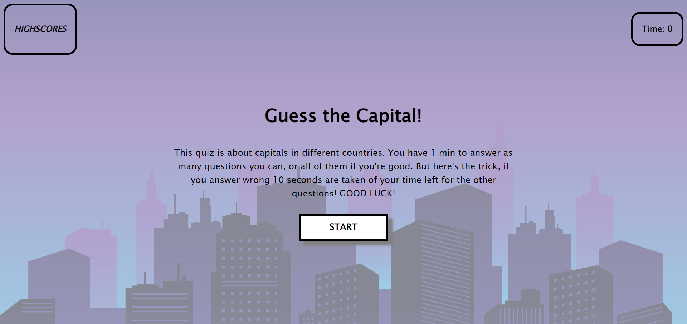

# <Quiz>

## Description

This is a quiz where the user would have to choose an answer of multiple options. The questions are capitals of countries, and the option answers are cities. When the user starts the quiz a countdown of 60 seconds is started, meaning the user has 60 seconds to answer all the questions.

* There is only one correct answer for each question.
* Every incorrect answer takes 10 seconds of the timer countdown.
* The score is the time left when all the questions are answered.
* The score is saved in a highscore table with the users name

## Installation

N/A

## Usage

Link to the deployed app: https://oliver23n.github.io/quiz/

## Credits

All code written and developed by Oliver Nasevski
https://github.com/oliver23n

## License

Refer to Repo
